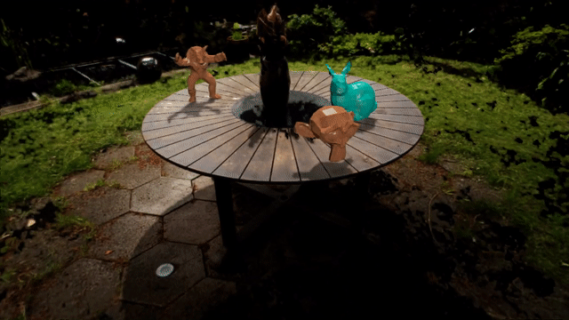
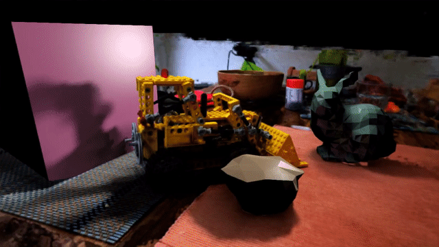

# SyNeRFgine

 

## Compiling SyNeRFgine

Begin by cloning this repository and all its submodules using the following command:
```sh
$ git clone --recursive https://github.com/nvlabs/instant-ngp
$ cd instant-ngp
```

Then, use CMake to build the project: (on Windows, this must be in a [developer command prompt](https://docs.microsoft.com/en-us/cpp/build/building-on-the-command-line?view=msvc-160#developer_command_prompt))
```sh
instant-ngp$ cmake . -B build -DCMAKE_BUILD_TYPE=RelWithDebInfo
instant-ngp$ cmake --build build --config RelWithDebInfo -j
```

If compilation fails inexplicably or takes longer than an hour, you might be running out of memory. Try running the above command without `-j` in that case.
If this does not help, please consult [this list of possible fixes](https://github.com/NVlabs/instant-ngp#troubleshooting-compile-errors) before opening an issue.

For other FAQ, visit [the original README](https://github.com/NVlabs/instant-ngp-README.md).

## Executable Options 

```
instant-ngp.exe \
  --snapshot <XXX.ingp file> OR --train \
  --virtual <XXX.json config> \
  --frag <fragment shader> \
  --width <px> \
  --height <px>
```

## Building a scene configuration

```json
{
  "camera" : {...}, // mandatory
  "output" : {...}, // optional
  "rendering" : {...}, // optional
  "lights" : {...}, // mandatory
  "objfile" : {...}, // mandatory
  "materials" : {...} // mandatory
}
```

Camera: 
```json
{
  "camera" : {
    // mandatory fields
    "view" : [-0.838,-0.502,-0.212],
    "at" : [0.519,0.318,0.506], 
    "zoom" : 1.225,
    //optional
    "clear_color" : [1.0, 0.0, 0.0],
    "show_ui": false,
    "end_on_loop" : true,
    "fps" : 24,
    "animation_speed" : 0.0,
    "total_time_ms" : 2000,
    "move_on_start" : true, // starts camera movement on startup
    // optional, with one or more keyframes
    "path" : [
      { // all fields are mandatory for each keyframe
        "view" : [ -0.8383388, -0.5022029, -0.21208571 ], 
        "at" : [ 0.51899993, 0.31799996, 0.5059999 ], 
        "zoom" : 1.225
      },
      {"view" : [ -0.7265459, -0.48169023, -0.49000606 ], "at" : [ 0.51899993, 0.31799996, 0.506 ], "zoom" : 1.225},
      ...
    ]
  },
  ...
}
```

Rendering: 
```json
{ 
  "rendering" : {
    // all fields are optional
    "res_factor" : 8, // lowest: 8, highest 64. divides 8 for downscaled resolution proportion
    "exposure" : 0.002, // scene exposure
    "light_samples": 4, // spp for distribution ray tracing
    "syn_shadow_samples": 2, // shadow samples spp
    "nerf_shadow_samples": 4, // nerf samples kernel size
    "syn_filter" : "Final", // Layer to view (Final, Next Origin, Next Direction, Normal, NerfShadow) 
    "nerf_filter" : "Shade", // Layer to view (Shade, Positions, Normals, ShadowDepth)
    "show_light_pos" : true, // shows the light gizmo on startup
    "nerf_on_nerf_shadow_threshold" : 0.002, // offset for shadow rays from NeRF
    "nerf_shadow_intensity" : 0.60,
    "syn_shadow_intensity" : 1.00,
    "path_trace_depth": 2, // depth of light bounced for path tracing.
    "lens_size" : 0.003, // lens for distribution ray tracing

    // controls what is displayed
    "show_virtual_obj" : true,
    "shadow_on_nerf" : true,
    "show_nerf" : true,
    "shadow_on_virtual_obj" : true
  },
  ...
}
```

Output:
```json
{
  "output": {
    "folder": "../out/output_folder",
    "record": false // begin recording on startup
  },
  ...
}
```

Light: 
```json
{
  "lights": [
    { // POINT LIGHT EXAMPLE
      "pos" : [-1.700, 5.0, -0.700], 
      "size" : 0.02,
      "intensity" : 1.0,
      "type": "point",
      // optional
      "anim" : {
        // mandatory
        "end" : [-1.700, 0.548, -0.700],
        "step" : 0.020
      }
    },
    { // DIRECTIONAL LIGHT EXAMPLE
      "pos" : [2.430, 1.465, 0.700],
      "size" : 0.3,
      "intensity" : 0.545,
      "type": "directional"
    }
  ],
  ...
}
```

Objects:
```json
{
  "objfile": [
    { 
      // mandatory
      "file": "../data/obj/armadillo.obj",
      "pos" : [ 0.313, 0.615, 0.736 ],
      "rot" : [ 0.996, 0.000, -0.087, 0.000, 1.000, 0.000, 0.087, 0.000, 0.996 ],
      "scale" : 0.500,
      "material": 0,
      // optional
      "anim" : {
        // mandatory
        "rot_center": [],
        "rot_axis": [],
        "rot_angle": 0.1 // rotational speed per unit time 
      }
    },
    ...
  ],
}
```

Materials:
```json
{
  "materials": [
    {
      // All following fields mandatory for lambertian
      "id": 0,
      "type": "lambertian",
      "n": 64.0,
      "rg": 0.5,
      "kd": [ 0.95, 0.3176, 0.1176 ]
    },
    {
      // All following fields mandatory for glossy material
      "id": 1,
      "type": "glossy",
      "n": 28.0,
      "rg": 0.2,
      "spec_angle": 0.001, // light scatter angle
      "kd": [
          0.0,
          1.0,
          0.8
      ]
    }, 
    ...
  ]
}
```
